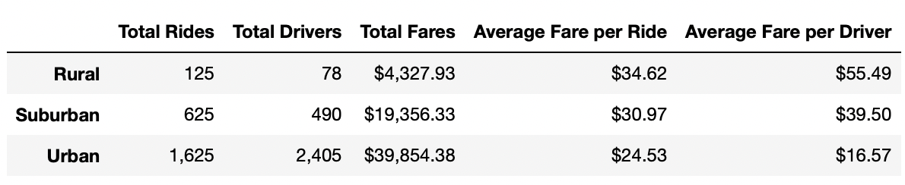

# PyBear_Analysis
## Overview of the analysis
### Purpose
The purpose of this analysis is to create a summary and visualizatoin of all ride-sharing data based by city type to help drive financial decisions at PyBer.
## Results
 The data provided for this analysis included the data for the PyBer ride-sharing program of three different city types, rural, suburban and urban. As can be seen in the DataFrame below, the amount of drivers for each city types differs drastically. There are a total of 2405 total urban drivesr, while there are only 79 rural drivers, and 490 suburban drivers. This DataFrame also shows the total amount of rides, total fares, average fare per ride and average fare per driver. 
  
 When seeing the whole picture, even though a majority total drivers and total rides take place in urban areas, the urban areas make up for the smallest average fare per ride, and the smallest average fare per driver. Rural drivers see the largest average fare per driver, coming at at just over $55. Suburban areas also performed better than urban areas when it comes to average fare per ride and average fare per ride, witha n average fare per ride just below $31, and average fare per driver just under $40.
 
 The line chart below also reinforces what can be seen in the DataFrame summary. The DataFrame summary showed that total revenue from fares form urban rides was higher then the other two city types. In the line chart, we see that urban rides are making a minimum of $1,500 a week, with some weeks approaching the $2,500 a week range. Rural rides made the least amount of total revenue from fares, which is also reflected in the line chart. From January to late april, there is only one week in which a rural area made at least $500.
 
 - line chart
## Summary
### Recommendations
There are three recommendations that have come as a result of conducting this analysis:
1. Create incentives for urban drivers to join PyBer. With the drastic difference in average fare per driver between rural and urban drivers, urban drivers could be swayed to cease working in urban areas, and switch to other city types, such as suburban or rural, in which they would more then double the amount  off Creating incenvitves for drivers could help promte a healthier. 
2. Increase the average fare per ride for users requesting a car in Urban areas, this could help increase the average fare per driver, and incentivize other drivers to stay in urban areas and not move to an area that has a more favorable, such as moving to a rural area.
3. Decrease the overall number of drivers in urban areas. In suburban and rural areas, there are more rides then drivers, something which is not the case in urban areas. By cutting some of the urban drivers, the average fare per ride and per driver will begin to increase.  
