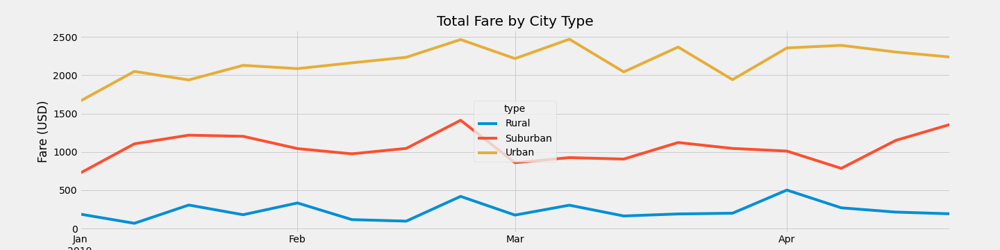

# PyBear_Analysis
## Overview of the analysis
### Purpose
The purpose of this analysis is to create a summary and visualizatoin of all ride-sharing data based by city type to help drive financial decisions at PyBer.
## Results
 The data provided for this analysis included the data for ride-sharing of three different city types, rural, suburban and urban.  As can be seen, the amount of drivers for each city types differs drastically. There are a total of 2405 total urban drivesr, while there are only 79 rural drivers, and 490 suburban drivers. 
